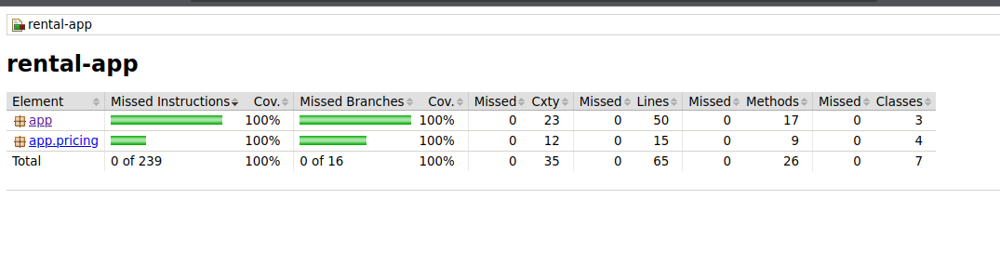
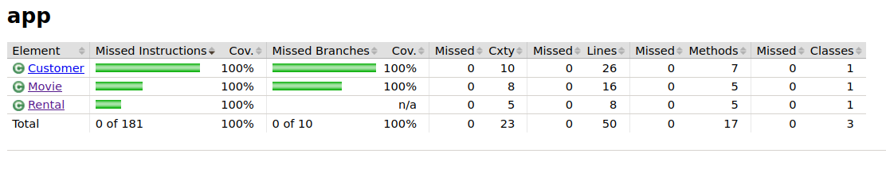
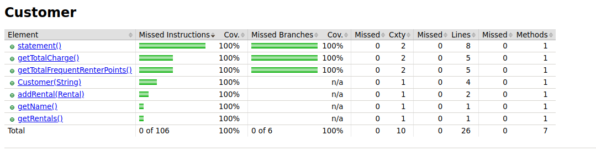
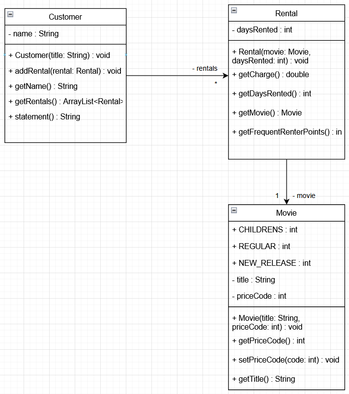
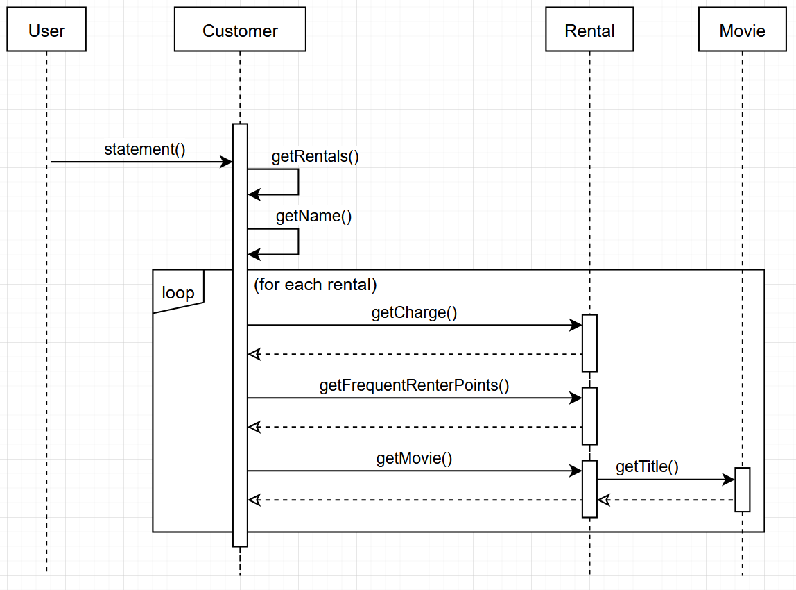
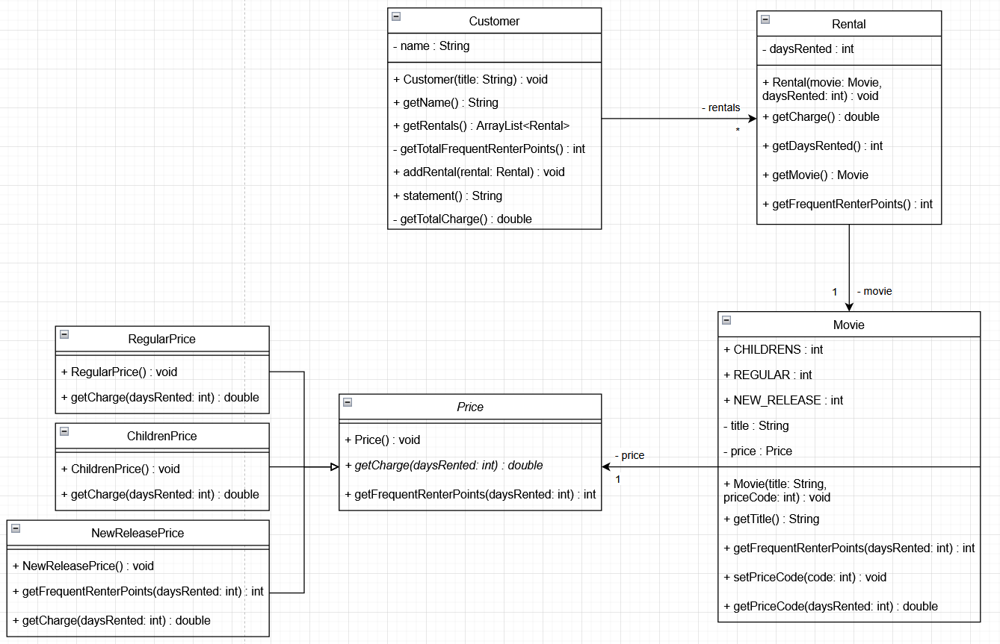
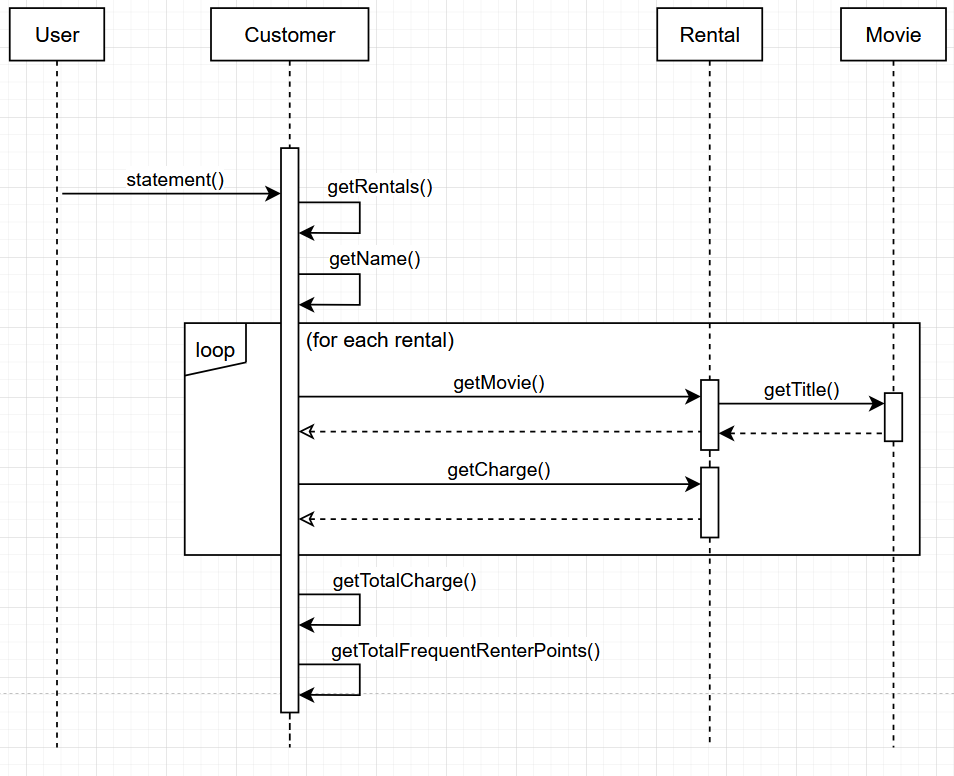

# TP3 - Maintenance
## Coverage

Rapport de couverture final :





## Diagrammes V1

### Diagramme de classes



### Diagramme de séquence



## Diagrammes V2

### Diagramme de classes



### Diagramme de séquence



## Maven commands

To build the project, run the following command:

```bash
# .
mvn clean install
```

### Tests

To run the tests, run the following command:

```bash
# .
mvn test
```

### Coverage

To generate the code coverage report, run the following command:

```bash
# .
mvn jacoco:report
```

The report will be generated in the `target/site/jacoco` directory.

```bash
# .
open target/site/jacoco/index.html
```
